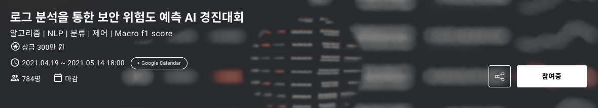
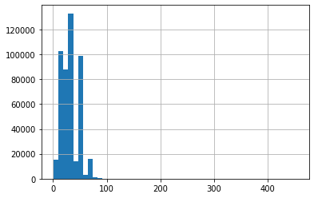
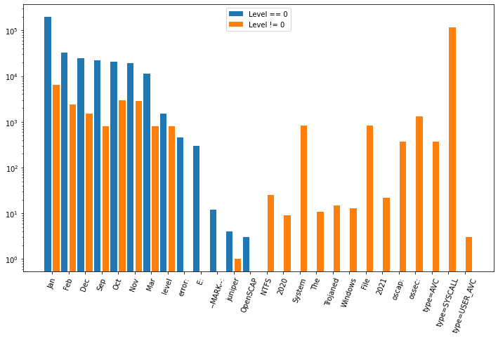
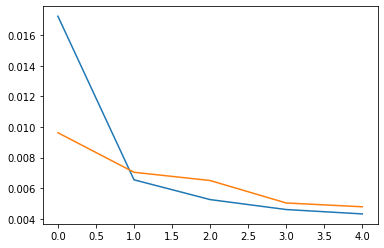

# DACON Log Security Risk Prediction

Portfolio archive for the DACON Log Security Risk Prediction AI competition. This repository organizes exploratory notebooks, model experiments, and a cleaned final XGBoost pipeline for multiclass security-risk classification from raw log text.



## Result

| Item | Details |
| --- | --- |
| Competition | 로그 분석을 통한 보안 위험도 예측 AI 경진대회 |
| Task | Classify security risk level from log text |
| Final rank | 57 / 152 teams |
| Metric | Macro F1 score |
| Main approach | Text tokenization + tree-based multiclass classifier |
| Final model | XGBoost classifier |
| Period | 2021.04.19 - 2021.05.14 |

## Project Structure

```text
.
|-- src/
|   `-- train_xgboost.py
|-- notebooks/
|   |-- 01_eda_log_patterns.ipynb
|   |-- 02_baseline_lightgbm_randomforest.ipynb
|   |-- 03_experiment_log_analysis.ipynb
|   |-- 04_self_attention_publiclb_083794.ipynb
|   `-- 05_final_xgboost_pipeline.ipynb
|-- assets/
|   |-- competition-banner.png
|   |-- log-length-distribution.png
|   |-- risk-token-prefix-comparison.png
|   `-- self-attention-training-curve.png
|-- requirements.txt
|-- LICENSE
`-- README.md
```

## What Was Cleaned

- Renamed mixed Korean notebook filenames into ordered portfolio notebooks.
- Removed notebook cell outputs and Colab execution metadata before publishing.
- Kept submission CSV files out of git because they are large generated artifacts.
- Added a reusable `src/train_xgboost.py` script for the final modeling pipeline.
- Added stable README images extracted from the original notebook outputs.

## Approach

The competition data consists of log text and a risk level label. The final portfolio pipeline follows the notebook logic:

1. Load `train.csv`, `test.csv`, and `sample_submission.csv`.
2. Split `full_log` and `level` into train and validation sets.
3. Fit a Keras `Tokenizer` on training log text.
4. Convert logs into integer token sequences.
5. Pad sequences to length 100.
6. Train an XGBoost multiclass classifier.
7. Evaluate validation performance with Macro F1.
8. Write a DACON-style submission file.

The final notebook records a validation Macro F1 of about `0.9472` during experimentation. The competition result was 57th out of 152 teams, so this repository is kept as a cleaned portfolio record rather than a winning-solution archive.

## Visual Notes

Log length distribution:



Risk-level token prefix comparison:



Self-attention experiment training curve:



## Run

The raw DACON data is not included. Place the competition files under `data/`:

```text
data/
|-- train.csv
|-- test.csv
`-- sample_submission.csv
```

Install dependencies:

```bash
pip install -r requirements.txt
```

Run the cleaned final pipeline:

```bash
python src/train_xgboost.py --data-dir data --output outputs/submission_xgboost.csv
```

## Notebook Guide

- `01_eda_log_patterns.ipynb`: initial log length, label distribution, and token-prefix exploration.
- `02_baseline_lightgbm_randomforest.ipynb`: baseline text tokenization with RandomForest and LightGBM experiments.
- `03_experiment_log_analysis.ipynb`: broader modeling trials including RandomForest, LightGBM, and XGBoost.
- `04_self_attention_publiclb_083794.ipynb`: transformer-style self-attention experiment.
- `05_final_xgboost_pipeline.ipynb`: cleaned final notebook around tokenization and XGBoost submission generation.

## License

This project is licensed under the MIT License. See [`LICENSE`](LICENSE).
